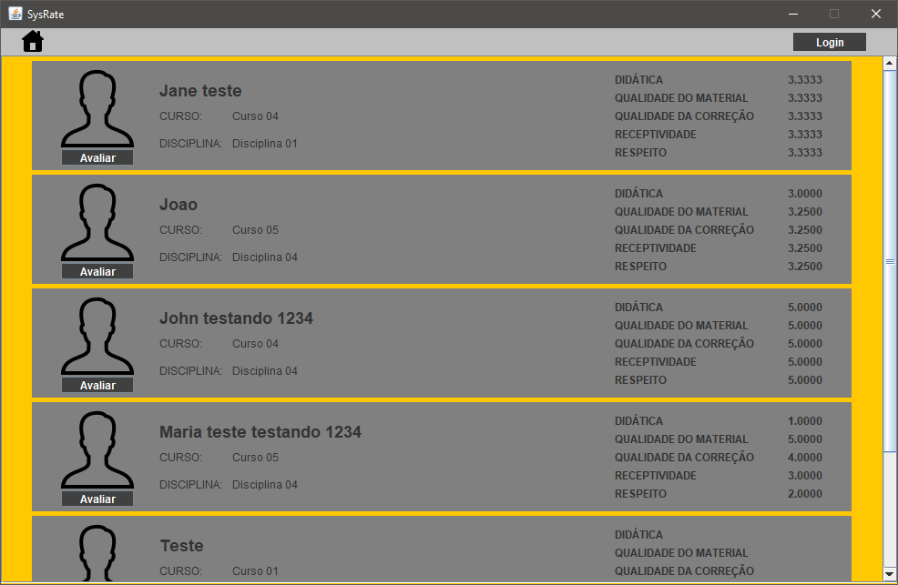
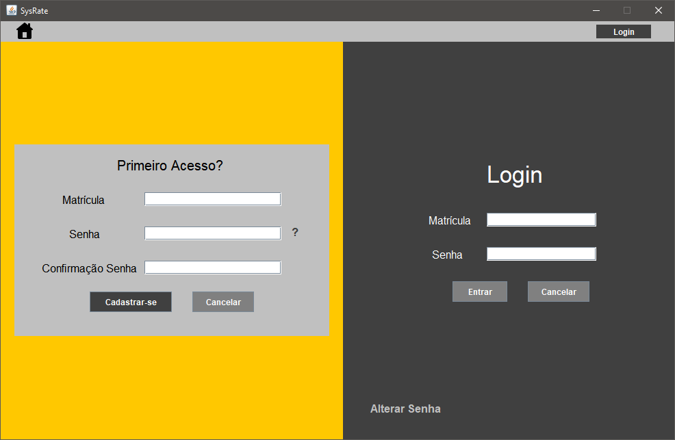
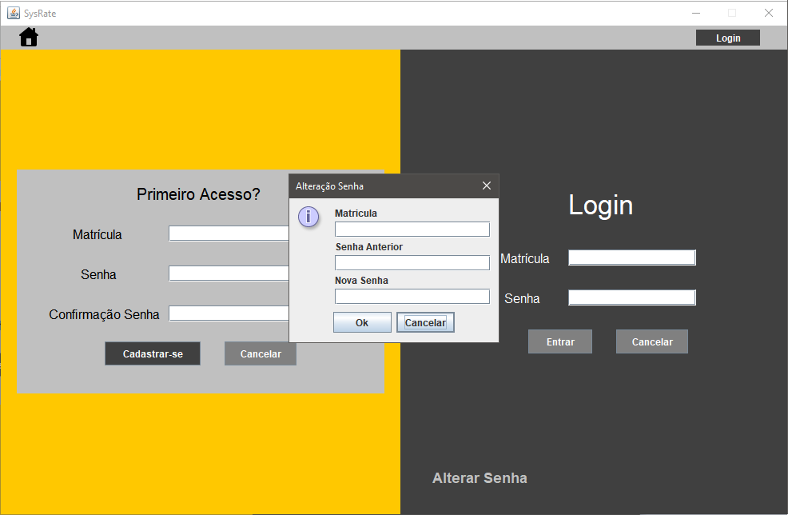
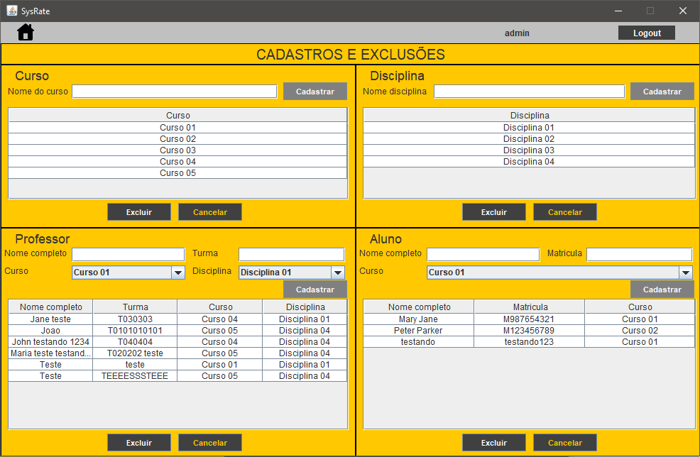
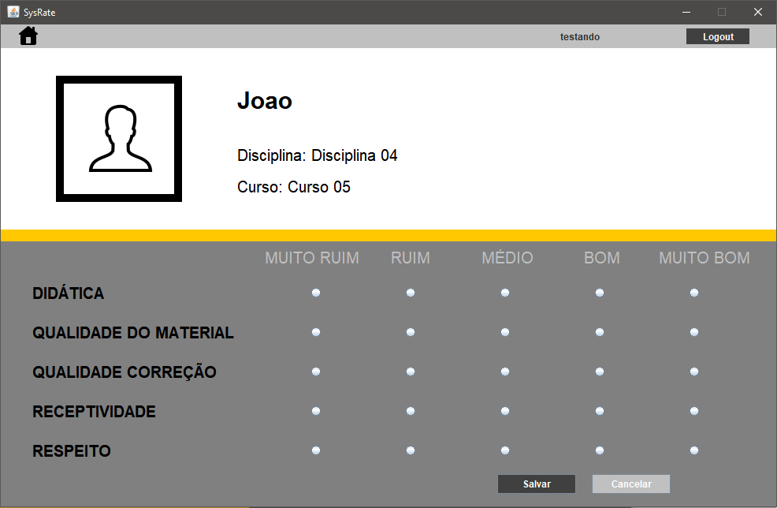

<h1 align="center">
      SysRate
</h1>

<h3 align="center">
    Sistema para que os alunos possam avaliar seus professores.
</h3>

<!--te-->


## 💻 Sobre o projeto

SysRate - É um sistema que foi desenvolvido para que os alunos pudessem avaliar de uma maneira simples e rápida seus professores através de tópicos pré cadastrados no sistema.
<br>
Dessa forma os professores avaliados poderão ver essa avaliação como forma de feedback em relação a sua conduta em sala de aula,
também os futuros alunos poderão ter ciência das avaliações dos professores, bem como a instituição escolar na qual o professor leciona.

O sistema foi desenvolvido em grupo, como projeto para conclusão do curso [Jovem Programador](https://jovemprogramador.com.br/).

---

## 🎨 Telas da aplicação

<h1 align="center">
  
  
  
  
  
</h1>

### Pré-requisitos

Antes de começar, você vai precisar ter instalado em sua máquina as seguintes ferramentas:
[Git](https://git-scm.com), [JDK11](https://www.oracle.com/br/java/technologies/javase/jdk11-archive-downloads.html), [MySQL](https://dev.mysql.com/downloads/).

Além disto é bom ter um editor para trabalhar com o código como [NetBeans](https://netbeans.apache.org/download/nb120/nb120.html)


```bash
# Clone este repositório
$ git clone <https://github.com/Francisco-Isganzella/SysRate.git>

# No NetBeans abra o projeto
# Na classe FabricaDeConexao altere o "SENHA na linha 25 pela senha configurada no seu MySQL
```

### 🛠 Tecnologias

As seguintes ferramentas foram usadas na construção do projeto:

- [Java](https://www.java.com/pt-BR/)
- [MySQL](https://www.mysql.com/)

---

## 🦸 Autores
[](https://www.linkedin.com/in/francisco-isganzella/)
[](https://www.linkedin.com/in/miguel-philippi-a437551b4/)
[](https://www.linkedin.com/in/tayna-moraes-bb3001180/)
[](https://www.linkedin.com/in/thiago-boimer-correia-a0b33211b/)
